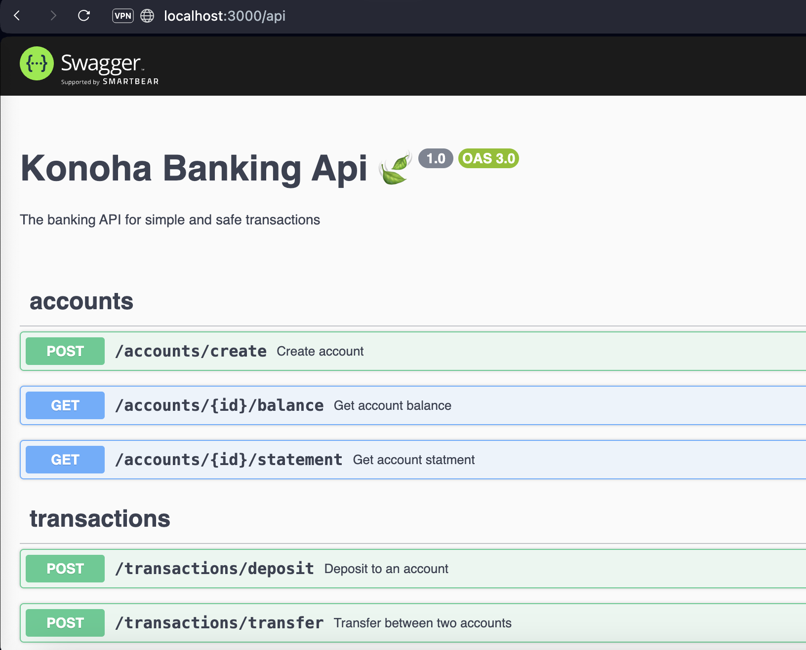
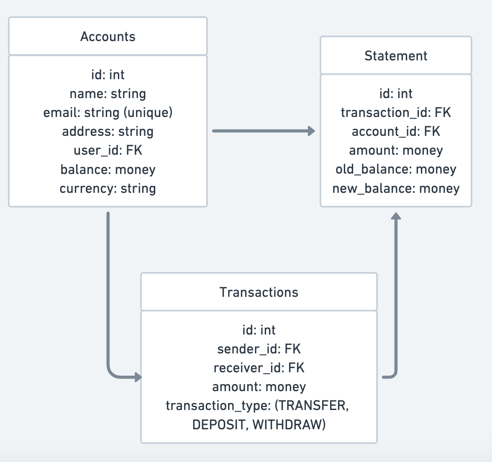
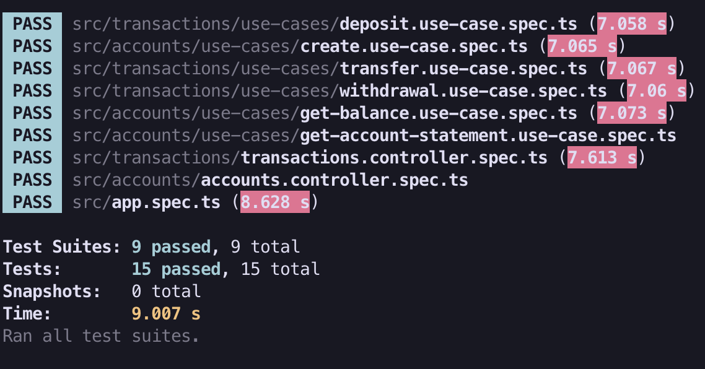

# Konoha Banking System API 🍃

### This application developed using the following technologies: NodeJS, TypeScript, NestJS, Fastify, Swagger, PostgreSQL, Docker  🛠

[](https://nodejs.org/en/) [](https://www.typescriptlang.org/) [](https://nestjs.com) [](https://swagger.io) [](https://www.postgresql.org/) [](https://docs.docker.com/)

This banking system was developed using Clean Archtecture concepts.


#### Requirements ✅

| Required  | Usage |
| ------------- | -------------- |
| Node 20.13.1     | For local deployment |
| npm 10.5.2     | For local deployment |
| Docker 3.x    | For containerizing the database |

#### Resources available ✅

| Status | Requisitos |
| ------------- | -------------- |
| ✅     | Create an account |
| ✅    | Make a deposit|
| ✅    | Get account balance |
| ✅ | Get account statement |
| ✅ | Transfer amount between two accounts |
| ✅ | Make a withdrawal |

#### OBS: There is a .env.example on the project, you just have to create a new copy with the name .env and it wil work

## Running the application 🍃

#### 🔴 OBS: I was not able to containerize the entire app, because there is an issue with Mac and Docker ports exposure. But there is a sever service inside the docker-compose that you can play with if you wish.


After cloning the project, run the following command:

```bash
npm run deploy:locally
```
> This command installs all dependencies, builds the postgres image on Docker, runs prisma generate and migrations, to finally start the project locally.

#### You can check the Swagger documentation on the following URL: 📜

```bash
http://localhost:3000/api
```
#### If the applications is running smoothly, you should see the Swagger UI as the image below:


## Database Structure 🧮

The reason why chose this structure is because it keeps the data consistent and solid, even though there is redunduncy in it:




## To run the all tests simply execute: 

```bash
npm run api:tests
```


#### Known issue: If you get an error executing the app.spec.ts, you have to delete manually the postgres container, image and volume. For some reason sometimes the data is not cleaned.


# This section is to run the project step by step manually 📋

- Create Postgres docker container
```bash
docker compose up -d
```
- Install dependencies
```bash
npm i
```
- Generate Prisma Client files

```bash
npx run prisma generate
```
- Run migrations
```bash
npx prisma migrate dev --name init
```
- Start the project
```bash
npm start
```

## Understanding the folder structure 🗂

    ├── .github           # Github media and possibly actions
    ├── prisma            # Prisma files with migration and database schema 
    ├── src               # Source files of the application
    │   ├── accounts      # Accounts module
    │   └── transactions  # Módulos da aplicação
    └── ...
## Understanding the application module folder structure 🗂

    src
    ├── accounts          # Accounts module
    │    ├── use-cases    # Account use cases for each user action with tests
    │    └── dto          # Data-transfer-object data
    ├── transactions      # Source files of the application
    │    ├── use-cases    # Transaction use cases for each user action with tests
    │    └── dto          
    └── ...